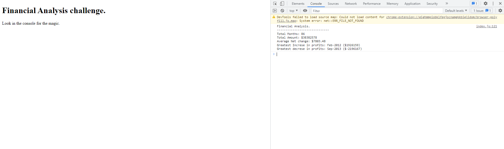

# challenge Financial Analysis.

This deployed site is to demonstrate my ability to find information using JavaScript. If you open up the console I have found the information set within the challenge which is to, find how many months are in the array, the total amount of losses/profits, the average change throughout the whole period, the greatest increase in profits and the greatest decrease in profits.

## link to deployed page.

https://marcahudson26.github.io/carnival-console-finances/

## screenshot.
 
